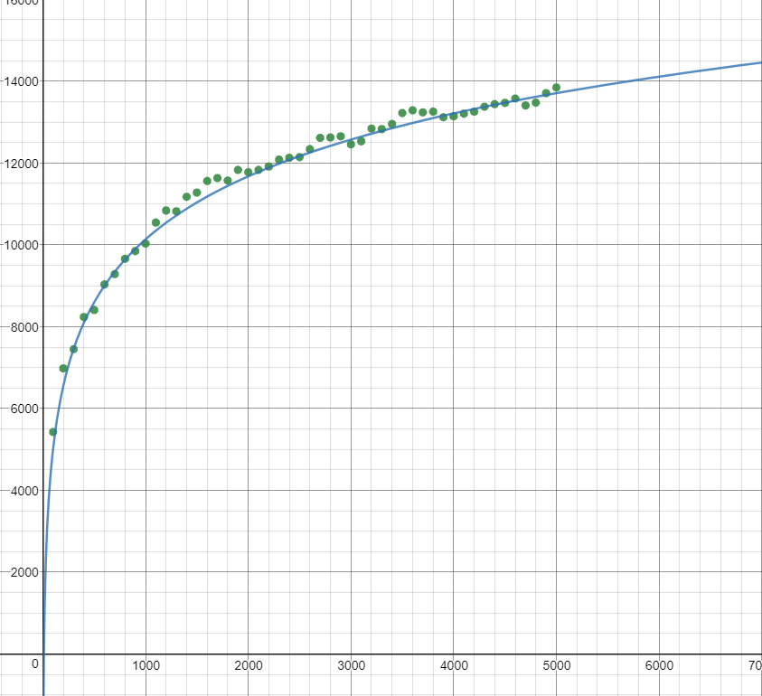

# Manhattan Tree

The manhattan tree is a spatial tree, based on the octree, that allows logarithmic time 
insertion, removal, and **querying for the element with the lowest manhattan distance
to an arbitrary point in space**.

### Octree

The design of this tree is based on the octree.


The total domain of the coordinate space is represented as a cube. This cube can be recursively 
sub-divided into 8 octants. 

We introduce two types for tracking these octants:

- The `BaseCoord`, containing unsigned integer coordinates, `[u64; 3]`.
- The `OctCoord`, containing unsigned integer coordinates, `[u64; 3]`, as well as scale factor, `u8`.

With these coordinates, we can define the two variants for an `Octant` (a node of the tree):

- `Leaf`, which contains a `BaseCoord` and some element that the tree is storing
- `Branch`, which contains an `OctCoord` and 8 optional child `Octant`s

In the case of the branch, in each dimension, the branch's domain covers the coordinate range 
from `coordinates[n] * (2 pow scale)` (inclusive) to `(coordinates[n] + 1) * (2 pow scale)`
(exclusive).

From here, we can lay out a couple important invariants:

1. Only leaves have elements
2. Only branches have children
3. An octant's domain is always a subdomain of its parent
4. A branch always has at least two children
5. Each of a branch's children are in a different suboctant of the branch

### Tree shortening

This repository implements the manhattan tree in 3 dimensions, but it actually can work in any dimension.
Let's take the example of a 1-dimensional manhattan tree.

A balanced 1-dimensional manhattan tree with 32 elements would look like this:

```
|----------------------------------------------------------------------------------------------|
|----------------------------------------------||----------------------------------------------|
|----------------------||----------------------||----------------------||----------------------|
|----------||----------||----------||----------||----------||----------||----------||----------|
|----||----||----||----||----||----||----||----||----||----||----||----||----||----||----||----|
|-||-||-||-||-||-||-||-||-||-||-||-||-||-||-||-||-||-||-||-||-||-||-||-||-||-||-||-||-||-||-||-|
0  1  2  3  4  5  6  7  8  9  10 11 12 13 14 15 16 17 18 19 20 21 22 23 24 25 26 27 28 29 30 31
```

A 1-dimensional manhattan tree has a branch factor of `2 pow 1 == 2`, and `log base 2 (32) == 5`,
and this tree has 5 branching layers (not including the root layer, or alternatively, 
not including the leaf layer), so it could be considered maximally efficient.

However, let's take a case where there are less elements, and we handle this *incorrectly*:

```
|----------------------------------------------------------------------------------------------|
|----------------------------------------------||----------------------------------------------|
|----------------------|                        |----------------------||----------------------|
            |----------|                                    |----------||----------|
                  |----|                                          |----||----|
                  |-||-|                                          |-|   |-|
                  6  7                                            22    24 
```

We have reduced the number of elements, but our tree is still just as tall. And remember, the 
time complexity of a tree is generally dependent on its height. We want to shorten the tree
while maintaining invariants 1 and 3:

> Only leaves have elements

> An octant's domain is always a subdomain of its parent

Furthermore, this tree structure severely breaks invariant 4:

> A branch always has at least two children

Fortunately, invariant 3 does not mean that an octant's domain must be a direct subdomain 
of its parent; it can be further down the chain. As such, we can shorten the tree by simply
cutting out the branches which only have one child, thus actualizing invariant 4, as such:

```
|----------------------------------------------------------------------------------------------|
|----------------------------------------------||----------------------------------------------|
                  |-||-|                                          |-|   |-|
                  6  7                                            22    24 
```

Now, the tree only has a height of three, and each branch has at least two children. Remember 
that, that although it's now harder to see, each leaf is still in a different suboctant of 
its parent branch.

### Bounds tracking

We include an additional piece of information in each octant, which was not previously 
mentioned. For each branch, and for each of the three dimensions, we encode the minimum
and maximum component in that dimension stored in the entire subtree. This data must 
be properly maintained upon insertions or removal into the manhattan tree.

### Manhattan distance

Given these invariants, we can efficiently perform the manhattan tree's namesake operation: 
**find the element with closest manhattan distance to an arbitrary focus**.

The focus is some arbitrary coordinate, just like any other key in the tree. 

As such, the function for closest element by manhattan distance to a focus, in Rust-like
pseudo code, is as follows:

```
fn closest(node: Octant, focus: BaseCoord, competitor: Option<BaseCoord>) -> Option<Leaf>:
    if node is a leaf:
        return the leaf, unless its mahattan dist (henceforth mdist) to focus is greater
        ...than the mdist between focus and competitor, if competitor exists
    if node is a branch:
        // here we take advantage of bounds to short circuit, which is the main performance boost
        if competitor exists:
            for each of the three dimensions:
                let a = competitor.mdist(focus)
                let b = the distance in that one dimension between focus, and node's 
                ...closest element to focus, according to the bounds tracking
                if a < b:
                    return None
    
        let best = None
        for each child, ordered nearest to furthest from focus:
            let child_competitor = {
                if best exists: Some(best's coord)
                else if competitor exists: Some(competitor)
                else: None
            } 
            if let Some(better) = closest(child, focus, child_competitor):
                best = Some(better)
        return best
```

### Bit-level hacking

Many of these operations, which are brushed over by abstract explanations and pseudocode, 
require operations on coordinates, such as:

- Which suboctant of an `OctCoord` contains a certain `BaseCoord`
- Which suboctant of an `OctCoord` is closest to a certain `BaseCoord`
- Convert a `OctCoord` into a `BaseCoord`
- What is the lowest common `OctCoord` for which two `BaseCoord`s are suboctants

Fortunately, because coordinates under the hood are stored as unsigned binary integers, 
and because recursive binary subdivision is performed on each dimension, the binary 
properties of the unsigned integers can be exploited to implement all of these operations
using bitwise manipulation. This is best expressed in actual code, which can be found in
the `tree/coord` module of this crate.

### Performance

I ran a performance test on the tree, testing insertion, removal, and closest element querying,
with different sizes of trees. To minimize external variables, these tests were run on a `t2.medium`
server, rented from Amazon EC2, running Ubuntu server 18.04.


These results clearly show a logarithmic time complexity. Running an additional test, going up 
to a tree size of 100,000, I manually fitted a natural logarithm function to the data.

 

The curve appears to closely follow the relation:

`time = 2220ns * ln(size) + 5200ns`